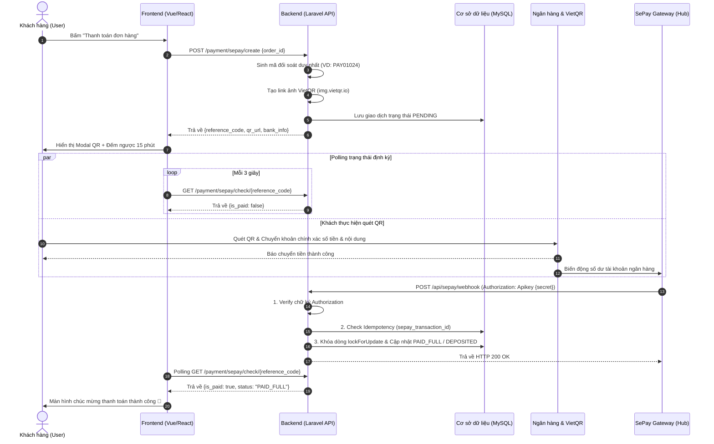

# SePay Payment Integration Skill

Bộ kỹ năng hoàn chỉnh hướng dẫn tích hợp giải pháp thanh toán tự động quét mã **VietQR** qua cổng **SePay (sepay.vn)** dành cho các dự án Laravel và Frontend (Vue 3 / React / Blade).

---

## 1. Kiến Trúc & Luồng Dữ Liệu (Architecture & Data Flow)

Hệ thống hoạt động dựa trên cơ chế kết hợp giữa **VietQR tĩnh/động** và **Webhook thông báo biến động số dư** từ SePay:



---

## 2. Cấu Trúc Bộ Skill & Thư Mục Mẫu (Skill Structure)

Bộ Skill được đóng gói hoàn chỉnh sẵn sàng copy/import sang bất kỳ dự án nào:

```text
.agent/skills/sepay-payment-integration/
├── SKILL.md                          # Tài liệu hướng dẫn tích hợp tổng thể (File này)
├── references/                       # Tài liệu đặc tả kỹ thuật chi tiết
│   ├── sepay_api_spec.md             # Đặc tả Webhook payload, header, HTTP status code
│   ├── idempotency_and_security.md   # Cơ chế chống trùng lặp, lockForUpdate, xử lý underpaid
│   ├── vietqr_specification.md       # Chuẩn mã VietQR NAPAS 247, template, cú pháp mã CK
│   └── test_scenarios.md             # 5 kịch bản kiểm thử cốt lõi (TC-01 đến TC-05)
└── templates/                        # Mã nguồn mẫu sẵn sàng sử dụng
    ├── env/.env.sepay.example        # Mẫu biến môi trường
    ├── config/sepay.php              # Cấu hình ngân hàng, mapping tên, template QR
    ├── migrations/
    │   └── 2026_01_01_000001_create_sepay_transactions_table.php # Bảng giao dịch chuẩn
    ├── Services/SePayService.php     # Service tạo QR, xác thực, parse mã, xử lý webhook
    ├── Controllers/
    │   ├── SePayWebhookController.php# Controller nhận webhook công khai
    │   └── SePayPaymentController.php# Controller tạo mã và polling cho frontend
    ├── routes/sepay_routes.php       # Định nghĩa route API & Web
    └── frontend/SepayVietQRModal.vue # Modal Vue 3 đếm ngược, copy STK, tự động polling
```

---

## 3. Quy Trình Tích Hợp Từng Bước (Step-by-Step Implementation)

### Bước 1: Khai báo Biến Môi Trường & Cấu Hình

1. Thêm các biến sau vào file `.env`:
   ```dotenv
   SEPAY_ACCOUNT_NUMBER=0388888888
   SEPAY_BANK_CODE=MB
   SEPAY_ACCOUNT_HOLDER=NGUYEN VAN A
   SEPAY_WEBHOOK_SECRET=your_super_secret_webhook_token_here
   SEPAY_REFERENCE_PREFIX=PAY
   SEPAY_QR_EXPIRES_MINUTES=15
   SEPAY_QR_TEMPLATE=compact
   ```
2. Copy file [sepay.php](./templates/config/sepay.php) vào thư mục `config/sepay.php` của dự án.

### Bước 2: Tạo Bảng Cơ Sở Dữ Liệu

Chạy migration để tạo bảng quản lý giao dịch thanh toán SePay:
```bash
php artisan make:migration create_sepay_transactions_table
```
Sử dụng schema mẫu từ file [2026_01_01_000001_create_sepay_transactions_table.php](./templates/migrations/2026_01_01_000001_create_sepay_transactions_table.php).

> 💡 **Quan trọng**: Cột `sepay_transaction_id` phải có ràng buộc `UNIQUE` để làm Idempotency Key.

### Bước 3: Đưa Service & Controller vào Dự án

1. Copy `templates/Services/SePayService.php` $\rightarrow$ `app/Services/SePayService.php`.
2. Copy `templates/Controllers/SePayWebhookController.php` $\rightarrow$ `app/Http/Controllers/Api/SePayWebhookController.php`.
3. Copy `templates/Controllers/SePayPaymentController.php` $\rightarrow$ `app/Http/Controllers/SePayPaymentController.php`.

### Bước 4: Đăng Ký Routes & Miễn Trừ CSRF

Thêm vào file `routes/api.php`:
```php
use App\Http\Controllers\Api\SePayWebhookController;
use App\Http\Controllers\SePayPaymentController;

// Webhook công khai nhận biến động từ SePay (Tự động miễn trừ CSRF trong api.php)
Route::post('/sepay/webhook', [SePayWebhookController::class, 'handle'])
    ->name('api.sepay.webhook');

// API thanh toán dành cho Frontend
Route::prefix('payment/sepay')->group(function () {
    Route::post('/create', [SePayPaymentController::class, 'createPayment']);
    Route::get('/check/{referenceCode}', [SePayPaymentController::class, 'checkStatus']);
    Route::post('/cancel/{referenceCode}', [SePayPaymentController::class, 'cancelPayment']);
    if (app()->environment('local')) {
        Route::post('/simulate/{referenceCode}', [SePayPaymentController::class, 'simulatePayment']);
    }
});
```

### Bước 5: Tích hợp Giao diện Frontend

1. Nhúng component Vue 3 mẫu từ file [SepayVietQRModal.vue](./templates/frontend/SepayVietQRModal.vue).
2. Khi người dùng bấm nút "Thanh toán":
   - Gọi API `/payment/sepay/create` với `{ order_id: 123 }`.
   - Nhận về `paymentData` và truyền vào `SepayVietQRModal`.
   - Modal sẽ tự động hiển thị mã QR, khởi chạy bộ đếm ngược 15 phút và kích hoạt Polling mỗi 3 giây.
   - Khi thanh toán thành công, Modal tự chuyển sang màn hình Success và emit event `@success`.

---

## 4. Nguyên Tắc An Toàn & Chống Trùng Lặp (Idempotency Safeguards)

1. **Bảo mật Webhook**: Luôn kiểm tra `Authorization: Apikey {secret}` bằng hàm so sánh an toàn `hash_equals()`.
2. **Chống cộng tiền lặp lại (Idempotency)**:
   - Trước khi cộng tiền hoặc xác nhận đơn hàng, kiểm tra xem `id` từ payload SePay đã tồn tại trong database chưa.
   - Nếu đã tồn tại: Log info và trả về ngay HTTP `200 OK` với thông báo `"ALREADY_PROCESSED"`.
3. **Pessimistic Locking**: Sử dụng `DB::transaction()` kết hợp `lockForUpdate()` trên bản ghi người dùng/đơn hàng để loại bỏ hoàn toàn rủi ro Race Condition khi nhiều webhook bắn đồng thời.
4. **Xử lý chuyển thiếu tiền (Underpaid)**:
   - Nếu khách chuyển thiếu tiền (dưới mức cọc tối thiểu), ghi nhận trạng thái `UNDERPAID` và lưu công nợ còn thiếu.
   - **Tuyệt đối không tự động kích hoạt dịch vụ**.
5. **Phản hồi HTTP chuẩn**: Trả về `200 OK` cho các giao dịch không tìm thấy đơn hoặc đã xử lý để tránh SePay gateway retry liên tục. Chỉ trả về `500` khi gặp sự cố máy chủ tạm thời cần retry.

---

## 5. Hướng Dẫn Mang Bộ Skill Sang Dự Án Khác

Để tái sử dụng toàn bộ bộ Skill này sang một dự án khác:

### Cách 1: Copy thủ công thư mục Skill
Chỉ cần copy toàn bộ thư mục `.agent/skills/sepay-payment-integration/` sang thư mục `.agent/skills/` của dự án mới:
```bash
cp -r .agent/skills/sepay-payment-integration /path/to/new-project/.agent/skills/
```

### Cách 2: Triển khai nhanh từ thư mục Templates
1. Copy file cấu hình:
   ```bash
   cp .agent/skills/sepay-payment-integration/templates/config/sepay.php config/sepay.php
   ```
2. Thêm các biến môi trường từ `templates/env/.env.sepay.example` vào file `.env`.
3. Copy migration, service và controller vào các thư mục tương ứng của Laravel.
4. Đăng ký route và sử dụng component Vue/React có sẵn.

---

## 6. Danh Mục Tài Liệu Tham Khảo Kỹ Thuật

- [Đặc tả SePay API & Webhook Payload Details](./references/sepay_api_spec.md)
- [Cơ chế Chống Trùng Lặp (Idempotency) & Bảo Mật](./references/idempotency_and_security.md)
- [Đặc tả Mã VietQR NAPAS 247 & Quy Chuẩn Mã Đối Soát](./references/vietqr_specification.md)
- [Kịch Bản Kiểm Thử Thanh Toán (5 Test Cases & cURL)](./references/test_scenarios.md)

---

## 7. Quy Chuẩn Toàn Vẹn Thanh Toán & Cổng Bàn Giao Đơn Hàng (Payment Integrity & Handover Gate)

> 📌 **Lưu ý triển khai**: Đây là các yêu cầu kỹ thuật và chốt chặn toàn vẹn dữ liệu được bóc tách từ Gói 2 để triển khai trọn gói trong Phase tích hợp SePay kế tiếp, tránh làm gián đoạn luồng vận hành của CSKH, KTV và QC ở giai đoạn hiện tại.

### 7.1. Chống Thanh Toán Trùng Lặp (Double Payment Prevention & Idempotency)
- **Ràng buộc duy nhất `unique` trên `transaction_ref`**:
  - Bảng `payments` hoặc `sepay_transactions` bắt buộc đánh chỉ mục `unique` trên trường `transaction_ref` (hoặc `sepay_transaction_id`).
  - Mọi request tạo phiếu thu từ Webhook SePay hoặc API thủ công nếu gửi trùng `transaction_ref` đã có trong hệ thống sẽ bị chặn ngay lập tức và trả về cảnh báo hoặc HTTP `200 ALREADY_PROCESSED` (đối với webhook) để tránh cộng tiền lặp lại.
- **Idempotency Key & Pessimistic Locking**:
  - Khi xử lý giao dịch ghi nhận thanh toán, sử dụng `DB::transaction()` kết hợp `RepairOrder::where('id', $orderId)->lockForUpdate()` để khóa dòng đơn hàng, loại bỏ race condition khi nhiều webhook hoặc client click đúp đồng thời.

### 7.2. Kiểm Soát Hạn Mức Thu Tiền (Overpayment Prevention)
- **Chặn thu vượt quá số dư còn lại**:
  - Công thức kiểm tra: `$remaining = $order->total_price - $order->paid_amount`.
  - Nếu số tiền thanh toán `$amount > $remaining`, hệ thống từ chối giao dịch và phản hồi lỗi HTTP 422: *"Số tiền thanh toán vượt quá số dư còn lại của đơn hàng"*.
  - Đối với webhook ngân hàng nhận tiền thừa (khách chuyển thừa), hệ thống ghi nhận giao dịch vào bảng `sepay_transactions` với trạng thái `OVERPAID` và tạo thông báo (Notification/AuditLog) để kế toán xử lý hoàn tiền thủ công, không tự ý phá vỡ toàn vẹn tài chính của đơn hàng.

### 7.3. Đồng Bộ Dữ Liệu Thanh Toán Trên Đơn Hàng (`repair_orders`)
- **Bổ sung các trường quản lý thanh toán**:
  - Thêm cột `paid_amount`: kiểu `decimal(15, 2)->default(0.00)` ghi nhận tổng lũy kế tiền khách đã thanh toán.
  - Thêm cột `payment_status`: kiểu `enum('unpaid', 'partially_paid', 'paid')->default('unpaid')`.
- **Logic tự động cập nhật khi nhận Webhook SePay**:
  - Khi giao dịch thanh toán thành công, cộng dồn `$order->paid_amount += $transaction->amount`.
  - Phân loại trạng thái thanh toán tự động:
    - Nếu `$order->paid_amount >= $order->total_price`: gán `$order->payment_status = 'paid'`.
    - Nếu `$order->paid_amount > 0 && $order->paid_amount < $order->total_price`: gán `$order->payment_status = 'partially_paid'`.
    - Nếu `$order->paid_amount == 0`: gán `$order->payment_status = 'unpaid'`.

### 7.4. Cổng Kiểm Soát Bàn Giao Máy (Handover Payment Gate)
- **Chốt chặn chuyển trạng thái sang `completed` / `delivered`**:
  - Tại hook `beforeTransition` của `OrderWorkflowService` và tại `ShipmentController::updateStatus` khi chuyển vận đơn sang `delivered`:
    - Kiểm tra điều kiện: `$order->payment_status === 'paid'` hoặc `$order->paid_amount >= $order->total_price`.
    - Nếu chưa thanh toán đủ: Hệ thống từ chối chuyển trạng thái và trả về HTTP 422: *"Đơn hàng chưa được thanh toán đầy đủ, không thể hoàn tất hoặc bàn giao máy"*.
- **Trường hợp ngoại lệ hợp lệ (Bypass Rules)**:
  - Đơn bảo hành hoặc dịch vụ miễn phí có `$order->total_price == 0`.
  - Đơn hàng có chính sách công nợ B2B / khách quen được phê duyệt đặc biệt bởi Quản lý chi nhánh (`is_debt_approved == true` hoặc có mã phê duyệt công nợ kèm log kiểm toán).

